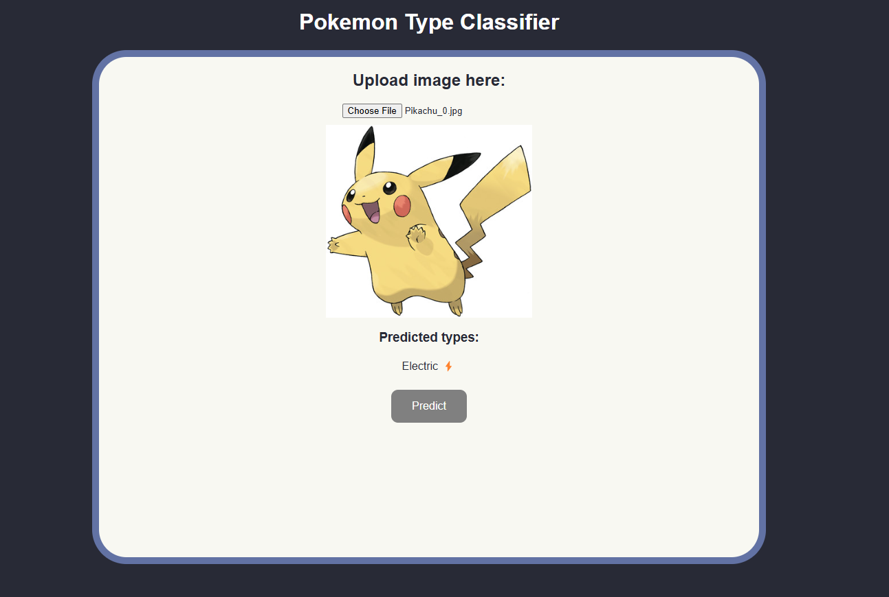

# About The Project

A convolutional neural network performing binary classification to classify Pokemon types developed with PyTorch.

The model can be called with an API created with Flask, with a React frontend for a UI.

# Structure

The CNN's architecture was based off [this](https://cs231n.github.io/convolutional-networks/#layers) lecture

